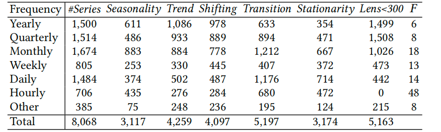

# Datasets

## Table of Contents

1. [Overview](#Overview)

1. [Univariate time series](#Univariate-time-series)

1. [Multivariate time series](#Multivariate-time-series)

1. [Dataset comprehensiveness](#Dataset-comprehensiveness)

   

## Overview

We equip TFB with a set of 25 multivariate and 8,068 univariate datasets with the following desirable properties. All datasets are formatted consistently. The collection is comprehensive, covering a wide range of domains and characteristics. The values of key characteristics of the multivariate and univariate datasets, as well as their classification based on the characteristics, can be found in  [Google Drive](https://drive.google.com/file/d/1oq5sX_FLc3mkjzd0dt27q_5EqxRKbgDS/view?usp=drive_link). This marks an improvement, addressing challenges such as different formats, varied documentation, and the time-consuming nature of dataset collection.  You can obtain the well pre-processed datasets from [Google Drive](https://drive.google.com/file/d/1oq5sX_FLc3mkjzd0dt27q_5EqxRKbgDS/view?usp=drive_link). 

## Univariate time series

<table class="table" style="width: 90%;">
  <thead>
    <tr>
      <th>Frequency</th>
      <th>#Series</th>
      <th>Seasonality</th>
      <th>Trend</th>
      <th>Shifting</th>
      <th>Transition</th>
      <th>Stationarity</th>
      <th>Lens&lt;300</th>
      <th>F</th>
    </tr>
  </thead>
  <tbody>
    <tr>
      <td>Yearly</td>
      <td>1,500</td>
      <td>611</td>
      <td>1,086</td>
      <td>978</td>
      <td>633</td>
      <td>354</td>
      <td>1,499</td>
      <td>6</td>
    </tr>
    <tr>
      <td>Quarterly</td>
      <td>1,514</td>
      <td>486</td>
      <td>933</td>
      <td>889</td>
      <td>894</td>
      <td>471</td>
      <td>1,508</td>
      <td>8</td>
    </tr>
    <tr>
      <td>Monthly</td>
      <td>1,674</td>
      <td>883</td>
      <td>884</td>
      <td>778</td>
      <td>1,212</td>
      <td>667</td>
      <td>1,026</td>
      <td>18</td>
    </tr>
    <tr>
      <td>Weekly</td>
      <td>805</td>
      <td>253</td>
      <td>330</td>
      <td>445</td>
      <td>407</td>
      <td>372</td>
      <td>473</td>
      <td>13</td>
    </tr>
    <tr>
      <td>Daily</td>
      <td>1,484</td>
      <td>374</td>
      <td>502</td>
      <td>487</td>
      <td>1,176</td>
      <td>714</td>
      <td>442</td>
      <td>14</td>
    </tr>
    <tr>
      <td>Hourly</td>
      <td>706</td>
      <td>435</td>
      <td>276</td>
      <td>284</td>
      <td>680</td>
      <td>472</td>
      <td>0</td>
      <td>48</td>
    </tr>
    <tr>
      <td>Other</td>
      <td>385</td>
      <td>75</td>
      <td>248</td>
      <td>236</td>
      <td>195</td>
      <td>124</td>
      <td>215</td>
      <td>8</td>
    </tr>
    <tr>
      <td>Total</td>
      <td>8,068</td>
      <td>3,117</td>
      <td>4,259</td>
      <td>4,097</td>
      <td>5,197</td>
      <td>3,174</td>
      <td>5,163</td>
      <td></td>
    </tr>
  </tbody>
</table>

<!--  -->

Table 1: Statistics of univariate datasets.

The univariate datasets are carefully curated from 16 open-source datasets, thus covering dozens of domains. To fully reflect the complexity of real-world time series, we employed Pattern Frequency Analysis (PFA), a variation of Principal Component Analysis (PCA). PFA preserves the original values of individual time series data points. We employ the concept of explained variance, representing the ratio between the variance of a single time series and the sum of variances across all individual time series. A threshold 𝑡 for the explained variance is set to 0.9. This implies that for each dataset, we choose to retain the minimum number of time series required to encompass 90% of the variance contributed by the remaining time series. As a result, the selected data exhibits pronounced heterogeneity. Compared to datasets with strong homogeneity, it can better reflect methods performance. In the end, we select 8,068 time series to enable the combined dataset to capture the diversity of real-world time series. Statistical information is reported in Table 1.

## Multivariate time series

<!--  -->

<table class="table" style="width: 60%;">
  <thead>
    <tr>
      <th>Dataset</th>
      <th>Domain</th>
      <th>Frequency</th>
      <th>Lengths</th>
      <th>Dim</th>
      <th>Split</th>
    </tr>
  </thead>
  <tbody>
    <tr>
      <td><a href="https://arxiv.org/abs/1707.01926">METR-LA</a></td>
      <td>Traffic</td>
      <td>5 mins</td>
      <td>34272</td>
      <td>207</td>
      <td>7:1:2</td>
    </tr>
    <tr>
      <td><a href="https://arxiv.org/abs/1707.01926">PEMS-BAY</a></td>
      <td>Traffic</td>
      <td>5 mins</td>
      <td>52116</td>
      <td>325</td>
      <td>7:1:2</td>
    </tr>
    <tr>
      <td><a href="https://ojs.aaai.org/index.php/AAAI/article/view/5438">PEMS04</a></td>
      <td>Traffic</td>
      <td>5 mins</td>
      <td>16992</td>
      <td>307</td>
      <td>6:2:2</td>
    </tr>
    <tr>
      <td><a href="https://ojs.aaai.org/index.php/AAAI/article/view/5438">PEMS08</a></td>
      <td>Traffic</td>
      <td>5 mins</td>
      <td>17856</td>
      <td>170</td>
      <td>6:2:2</td>
    </tr>
    <tr>
      <td><a href="https://proceedings.neurips.cc/paper/2021/hash/bcc0d400288793e8bdcd7c19a8ac0c2b-Abstract.html">Traffic</a></td>
      <td>Traffic</td>
      <td>1 hour</td>
      <td>17544</td>
      <td>862</td>
      <td>7:1:2</td>
    </tr>
    <tr>
      <td><a href="https://ojs.aaai.org/index.php/AAAI/article/view/17325">ETTh1</a></td>
      <td>Electricity</td>
      <td>1 hour</td>
      <td>14400</td>
      <td>7</td>
      <td>6:2:2</td>
    </tr>
    <tr>
      <td><a href="https://ojs.aaai.org/index.php/AAAI/article/view/17325">ETTh2</a></td>
      <td>Electricity</td>
      <td>1 hour</td>
      <td>14400</td>
      <td>7</td>
      <td>6:2:2</td>
    </tr>
    <tr>
      <td><a href="https://ojs.aaai.org/index.php/AAAI/article/view/17325">ETTm1</a></td>
      <td>Electricity</td>
      <td>15 mins</td>
      <td>57600</td>
      <td>7</td>
      <td>6:2:2</td>
    </tr>
    <tr>
      <td><a href="https://ojs.aaai.org/index.php/AAAI/article/view/17325">ETTm2</a></td>
      <td>Electricity</td>
      <td>15 mins</td>
      <td>57600</td>
      <td>7</td>
      <td>6:2:2</td>
    </tr>
    <tr>
      <td><a href="https://ergodicity.net/2013/07/">Electricity</a></td>
      <td>Electricity</td>
      <td>1 hour</td>
      <td>26304</td>
      <td>321</td>
      <td>7:1:2</td>
    </tr>
    <tr>
      <td><a href="https://dl.acm.org/doi/abs/10.1145/3209978.3210006">Solar</a></td>
      <td>Energy</td>
      <td>10 mins</td>
      <td>52560</td>
      <td>137</td>
      <td>6:2:2</td>
    </tr>
    <tr>
      <td><a href="https://dl.acm.org/doi/abs/10.1145/3209978.3210006">Wind</a></td>
      <td>Energy</td>
      <td>15 mins</td>
      <td>48673</td>
      <td>7</td>
      <td>7:1:2</td>
    </tr>
    <tr>
      <td><a href="https://proceedings.neurips.cc/paper/2021/hash/bcc0d400288793e8bdcd7c19a8ac0c2b-Abstract.html">Weather</a></td>
      <td>Environment</td>
      <td>10 mins</td>
      <td>52696</td>
      <td>21</td>
      <td>7:1:2</td>
    </tr>
    <tr>
      <td><a href="https://royalsocietypublishing.org/doi/abs/10.1098/rspa.2017.0457">AQShunyi</a></td>
      <td>Environment</td>
      <td>1 hour</td>
      <td>35064</td>
      <td>11</td>
      <td>6:2:2</td>
    </tr>
    <tr>
      <td><a href="https://royalsocietypublishing.org/doi/abs/10.1098/rspa.2017.0457">AQWan</a></td>
      <td>Environment</td>
      <td>1 hour</td>
      <td>35064</td>
      <td>11</td>
      <td>6:2:2</td>
    </tr>
    <tr>
      <td><a href="https://academic.oup.com/treephys/article-abstract/36/12/1449/2571314">ZafNoo</a></td>
      <td>Nature</td>
      <td>30 mins</td>
      <td>19225</td>
      <td>11</td>
      <td>7:1:2</td>
    </tr>
    <tr>
      <td><a href="https://academic.oup.com/treephys/article-abstract/36/12/1449/2571314">CzeLan</a></td>
      <td>Nature</td>
      <td>30 mins</td>
      <td>19934</td>
      <td>11</td>
      <td>7:1:2</td>
    </tr>
    <tr>
      <td><a href="https://www.tandfonline.com/doi/abs/10.1080/07350015.2015.1086655">FRED-MD</a></td>
      <td>Economic</td>
      <td>1 month</td>
      <td>728</td>
      <td>107</td>
      <td>7:1:2</td>
    </tr>
    <tr>
      <td><a href="https://dl.acm.org/doi/abs/10.1145/3209978.3210006">Exchange</a></td>
      <td>Economic</td>
      <td>1 day</td>
      <td>7588</td>
      <td>8</td>
      <td>7:1:2</td>
    </tr>
    <tr>
      <td><a href="https://dl.acm.org/doi/abs/10.1145/3309547">NASDAQ</a></td>
      <td>Stock</td>
      <td>1 day</td>
      <td>1244</td>
      <td>5</td>
      <td>7:1:2</td>
    </tr>
    <tr>
      <td><a href="https://dl.acm.org/doi/abs/10.1145/3309547">NYSE</a></td>
      <td>Stock</td>
      <td>1 day</td>
      <td>1243</td>
      <td>5</td>
      <td>7:1:2</td>
    </tr>
    <tr>
      <td><a href="https://www.sciencedirect.com/science/article/pii/S0957417412000528">NN5</a></td>
      <td>Banking</td>
      <td>1 day</td>
      <td>791</td>
      <td>111</td>
      <td>7:1:2</td>
    </tr>
    <tr>
      <td><a href="https://proceedings.neurips.cc/paper/2021/hash/bcc0d400288793e8bdcd7c19a8ac0c2b-Abstract.html">ILI</a></td>
      <td>Health</td>
      <td>1 week</td>
      <td>966</td>
      <td>7</td>
      <td>7:1:2</td>
    </tr>
    <tr>
      <td><a href="https://ojs.aaai.org/index.php/AAAI/article/view/16616">Covid-19</a></td>
      <td>Health</td>
      <td>1 day</td>
      <td>1392</td>
      <td>948</td>
      <td>7:1:2</td>
    </tr>
    <tr>
      <td><a href="https://proceedings.mlr.press/v89/gasthaus19a.html">Wike2000</a></td>
      <td>Web</td>
      <td>1 day</td>
      <td>792</td>
      <td>2000</td>
      <td>7:1:2</td>
    </tr>
  </tbody>
</table>

Table 2: Statistics of multivariate datasets.

Table 2 lists statistics of the 25 multivariate time series datasets, which cover 10 domains. The frequencies vary from 5 minutes to 1 month, the range of feature dimensions varies from 5 to 2,000, and the sequence length varies from 728 to 57,600. This substantial diversity of the datasets enables comprehensive studies of forecasting methods. To ensure fair comparisons, we choose a fixed data split ratio for each dataset chronologically, i.e., 7:1:2 or 6:2:2, for training, validation and testing.

## Dataset comprehensiveness

We proceed to investigate the coverage of the selected univariate and multivariate datasets.

### Univariate time series

Figure 1: Hexbin plots showing normalised density values of the low-dimensional feature spaces generated by PCA across trend, seasonality, stationarity, shifting, and transition for 9 univariate datasets.

Since time series have different lengths, we first represent time series as vectors that consist of five feature indicators: trend, seasonality, stationarity, shifting, and transition. For ease of visualization, we adopt PCA to reduce the dimensionality from five to two and visualize the eight most widely distributed univariate time series datasets in hexbin—see Figure 1. We observe that TFB and M4 cover the most cells, while all other benchmarks are smaller than TFB. This emphasizes the coverage of our dataset in terms of diversity in characteristic distribution. In addition, compared to M4, our dataset covers a wider range of domains. Further, we note that M4 has a much larger sample size, totaling 100,000, compared to our dataset that contains only 8,068 time series. We believe that testing on diverse datasets is essential to better reflect the practical performance of methods. Yet, we can run much fewer experiments with TFB than the M4 dataset, i.e., around 8%.

### Multivariate time series

Figure 2: Statistics of data domains covered by existing multivariate time series benchmarks.

Figure 3: Box plot of the variations in normalized values of characteristics across the multivariate datasets in the TFB and TSlib.

Figure 2 shows a comparison of TFB and existing multivariate time series benchmarks according to dataset domain distribution. Our benchmark includes more diverse datasets in terms of both quantity and domain categories. Next, we select TSlib, whose multivariate time series datasets are the most popular, to compare the characteristic distributions with TFB, which are shown in Figure 3. We can observe that the datasets in TFB also represent a more diverse characteristic distribution.
